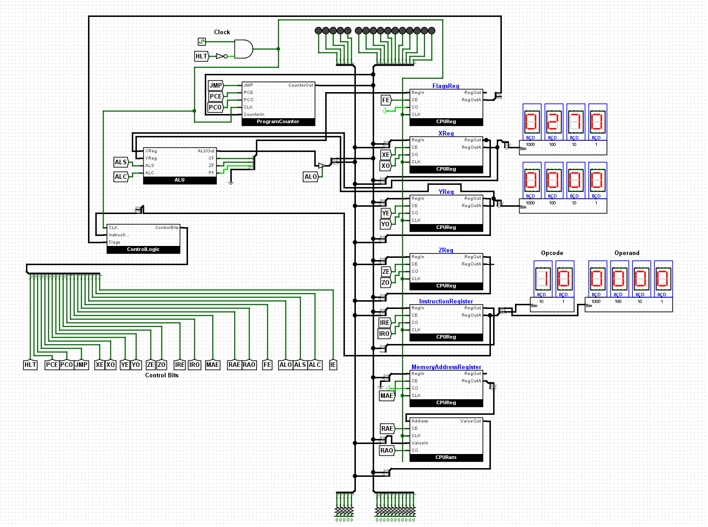

# 16 Bit CPU

Simple 16 bit cpu implemented using Logisim Evolution based on the SAP-1 computer.

## Features

1) 16 Bit bus (5 for opcode and 11 for addresses)
2) 2k ram addresses
3) 2K Microcode ROM
4) 20 Control Signals
5) Basic ALU
6) 2048 Max operations per program.
7) Program for generating the Microcode ROM.
8) Program for compiling a assembly program into the microcode.

## Operations

1) **ADD (address)**: Adds to the value in X register the value in address and stores it in Z register.
2) **SUB (address)**: Subtracts to the value in X register the value in address and stores it in Z register.
3) **INCX**: Increments the X register by 1.
4) **INCY**: Increments the Y register by 1.
5) **INCZ**: Increments the Z register by 1.
6) **DECX**: Decrements the X register by 1.
7) **DECY**: Decrements the Y register by 1.
8) **DECZ**: Decrements the Z register by 1.
9) **LDX (address)**: Loads the value stored in address to the X register.
10) **LDY (address)**: Loads the value stored in address to the Y register.
11) **LDZ (address)**: Loads the value stored in address to the Z register.
12) **LDIX (value)**: Loads the inmediate value in the X register.
13) **LDIY (value)**: Loads the inmediate value in the Y register.
14) **LDIZ (value)**: Loads the inmediate value in the Z register.
15) **JMP (address)**: Jumps to the given address.
16) **JMC (address)**: Jumps to the given addres if carry flag = 1.
17) **JMZ (address)**: Jumps to the given address if zero flag = 1.
18) **JME (address)**: Jumps to the given address if parity flag = 1.
19) **HLT**: Halts the CPU.

## Control Signals (20 bits)

1) **HLT**: CPU Halt.
2) **PCE**: Program Counter Enable.
3) **PCO**: Program Counter Output.
4) **JMP**: Program Counter Load Enable.
5) **XE**: A Register Enable.
6) **XO**: A Register Output.
7) **YE**: B Register Enable.
8) **YO**: B Register Output.
9) **ZE**: C Register Enable.
10) **ZO**: C Register Output.
11) **IRE**: Instruction Register Enable.
12) **IRO**: Instruction Register Output.
13) **MAE**: Memory Address Register Enable.
14) **RAE**: RAM Enable.
15) **RAO**: RAM Out.
16) **FE**: Flags Register Enable.
17) **ALO**: ALU Output.
18) **ALS**: ALU Subract.
19) **ALC**: ALU Constant 1.
20) **IE**: Instruction End.

## Address Signals (11 bits)

1) **PF**: Parity Flag.
2) **ZF**: Zero Flag.
3) **CF**: Carry Flag.
4) **I4**: Instruction Op Code 4.
5) **I3**: Instruction Op Code 3.
6) **I2**: Instruction Op Code 2.
7) **I1**: Instruction Op Code 1.
8) **I0**: Instruction Op Code 0.
9) **S2**: Instruction Step 2.
10) **S1**: Instruction Step 1.
11) **S0**: Instruction Step 0.
